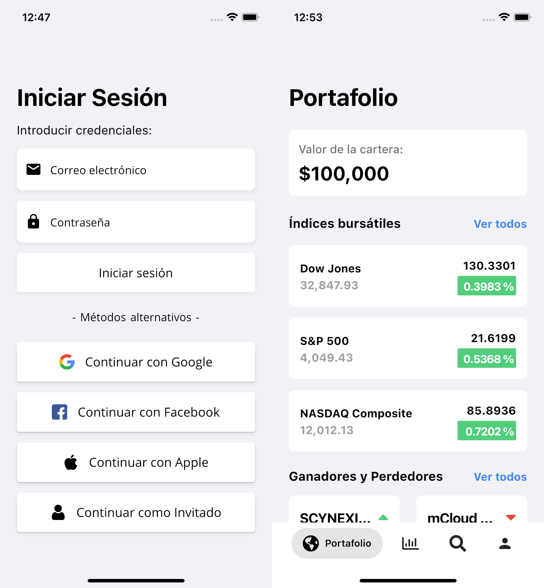

# Stock Market Simulator

Welcome to the Stock Market Simulator! This is a project I open sourced as part of a Software Engineering Virtual Experience. The simulator's user interface for trading is largely complete, with the backend development work currently in progress.

**Note:** This project contains sensitive Firebase data that I have since deleted, and users should not attempt to access it. If you would like to use Firebase in your own version of this project, please replace the necessary Firebase configuration files with your own.

## Getting Started

To use the simulator, you will need to obtain your own API keys for the financial data sources. You can get the API keys from the following providers:

- [Alpha Vantage](https://www.alphavantage.co/support/#api-key)
- [IEX Cloud](https://iexcloud.io/docs/api/)
- [Financial Modeling Prep](https://financialmodelingprep.com/developer/docs/)

Once you have obtained your API keys, you will need to add them in the HttpLibrary file. 

## Technologies Used

The project uses the following technologies:

- Firebase
- AWS
- Flutter
- Dart

## Contributing

I welcome contributions to this project! If you have any suggestions, bug reports, or feature requests, please open an issue on the project's [GitHub repository](https://github.com/JoshuaR503/Stock-Market-Simulator/issues).

